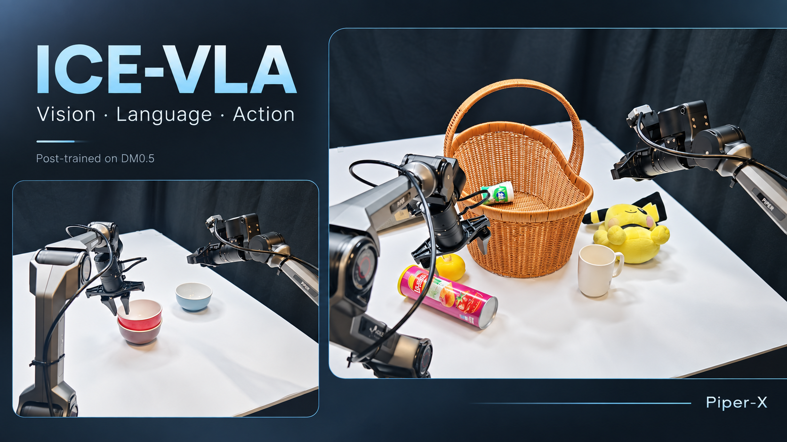

# ICE-VLA



<sub>基于实机照片经 AI 合成与修饰的展示图，非未经编辑的实验记录。</sub>

ICE_VLA 是面向 GOAI 双机械臂 Piper-X 平台的 VLA 评测提交仓库，包含评测机上实际
运行的两个策略适配器（DM05 与 OpenDM）、评测初始化脚本、推理代码，以及所依赖的
DM0.5 模型结构。

## 提交内容

| 路径 | 内容 |
| --- | --- |
| `policy/DM05/deploy.py` | 评测机部署主循环：25 Hz 异步 RTC 双速率执行、动作校验与安全门控 |
| `policy/DM05/model.py` | DM05 推理适配器：LoRA 基座加载、三相机/14 维状态组装、50 步动作块与 RTC 接口 |
| `policy/DM05/deploy.yml` | DM05 部署配置（PiperX、joint、14 维、50 步块、端口 6001） |
| `policy/DM05/rtc_sampling.py`、`rtc_continuity.py` | RTC 的 VJP 引导流修复采样与块间连续性投影 |
| `policy/DM05/opendm/` | DM0.5 模型结构、归一化、数据变换与推理实现（`opendm.model.dm05`） |
| `policy/OpenDM/` | OpenDM 策略适配器与参考部署/评测脚本 |
| `policy/OpenDM/setup_eval_policy_server.sh` | 评测初始化脚本（策略服务端），读取 `deploy.yml` 并注入本次运行覆盖项 |
| `policy/OpenDM/setup_eval_env_client.sh` | 评测初始化脚本（环境客户端），连接策略服务并驱动评测环境 |
| `setup_policy_server.py` | 策略服务器入口：加载 `XPolicyLab.policy.<POLICY>.model` 并以 WebSocket 暴露推理 |
| `utils/` | 观测解码、状态打包/解包、动作维度解析、检查点解析等共享工具 |
| `docs/REPORT.md` | 技术报告（简要） |

代码为评测机上实际运行的版本，仅移除了缓存、日志与权重文件。

## 评测初始化与启动

标准评测入口遵循 XPolicyLab 的参数约定：

```bash
bash policy/OpenDM/eval.sh <bench_name> <task_name> <ckpt_name> <env_cfg_type> \
  <action_type> <seed> <policy_gpu_id> <env_gpu_id> <policy_env_or_uv_path> \
  <eval_env_conda_env>
```

分机部署时分别启动两侧：

```bash
# 策略服务端
bash policy/OpenDM/setup_eval_policy_server.sh \
  RoboDojo <task_name> <ckpt_name> piper joint 0 0 <conda_env> 6001 0.0.0.0

# 环境客户端
bash policy/OpenDM/setup_eval_env_client.sh \
  RoboDojo <task_name> <ckpt_name> piper joint 0 <gpu_id> <conda_env> "" 6001 <policy_host>
```

DM05 另提供 `policy/DM05/run_server.sh`，直接以本目录 `deploy.yml` 启动策略服务。

## 模型与数据契约

- 基座：DM0.5（`Dexmal/DM05`），视觉-语言骨干 + 流匹配动作专家，6,153,393,584 参数。
- 适配：LoRA `r=32`、`alpha=16`、`all-linear`，并对动作投影、time MLP 与全部
  time modulator 做稠密微调；可训练参数 324,281,376（5.27%），基座冻结。
- 观测：头部 + 左腕 + 右腕三路 RGB，14 维本体状态。
- 动作：14 维绝对关节/夹爪目标，分块长度 50，控制频率 25 Hz。

## 上游致谢

- [XPolicyLab](https://github.com/OpenHLab/XPolicyLab)：策略适配器框架与评测协议。
- [OpenDM / DM0.5](https://github.com/dexmal/opendm)（Apache-2.0）：基座模型与模型结构，
  见 `policy/DM05/opendm/UPSTREAM.md`。

## 许可

本仓库根目录 `LICENSE` 沿用上游 Apache-2.0；`policy/DM05/opendm/` 为其原始许可证副本。
